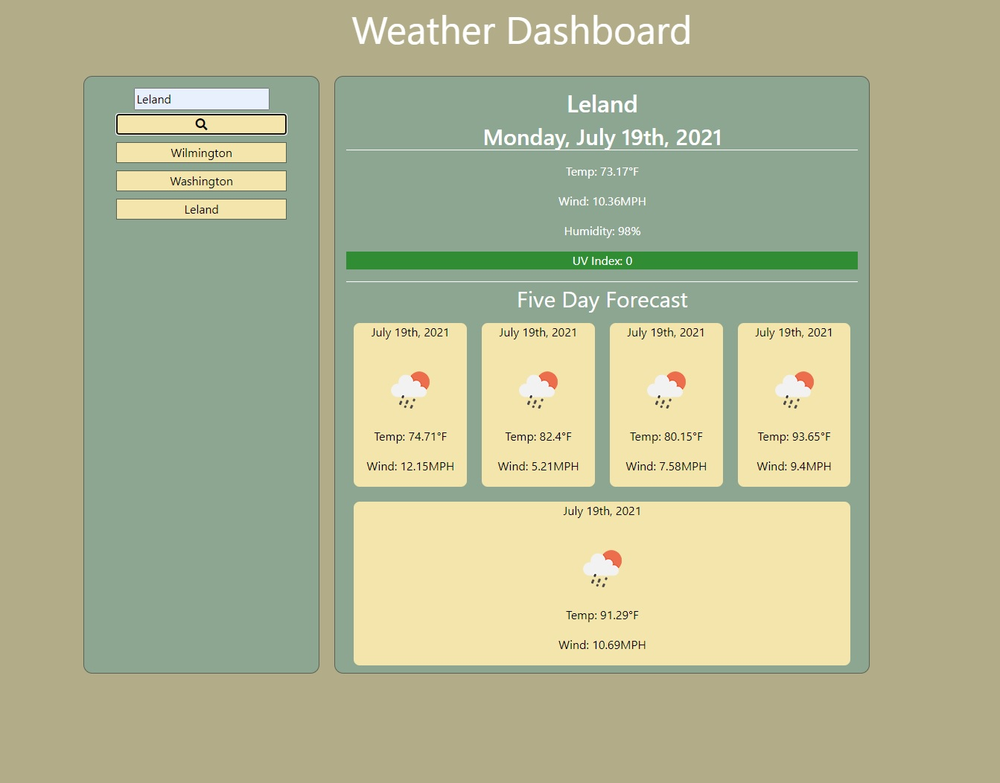

# Weather_Dashboard

## Layout
Created initial layout and styled with bootstrap and custom CSS

## Current Day
Added js to display current weather city name, current conditions, and current day

## Forecast
Added code to use initial fetch to gather information for an additional call for the forecast
Dynamically created forecast area with symbols, temps, and wind speeds

## UV Index
Changed background color for UV index

## Previous Searches
Dynamically created buttons from previous searches

## Restoring page
Added code to remove previous search data to avoid having multiples of each search

## Updated functionality
Fixed code for pulling local storage data
Added code to pull value from dynamically created city buttons so they will display desired weather conditions

