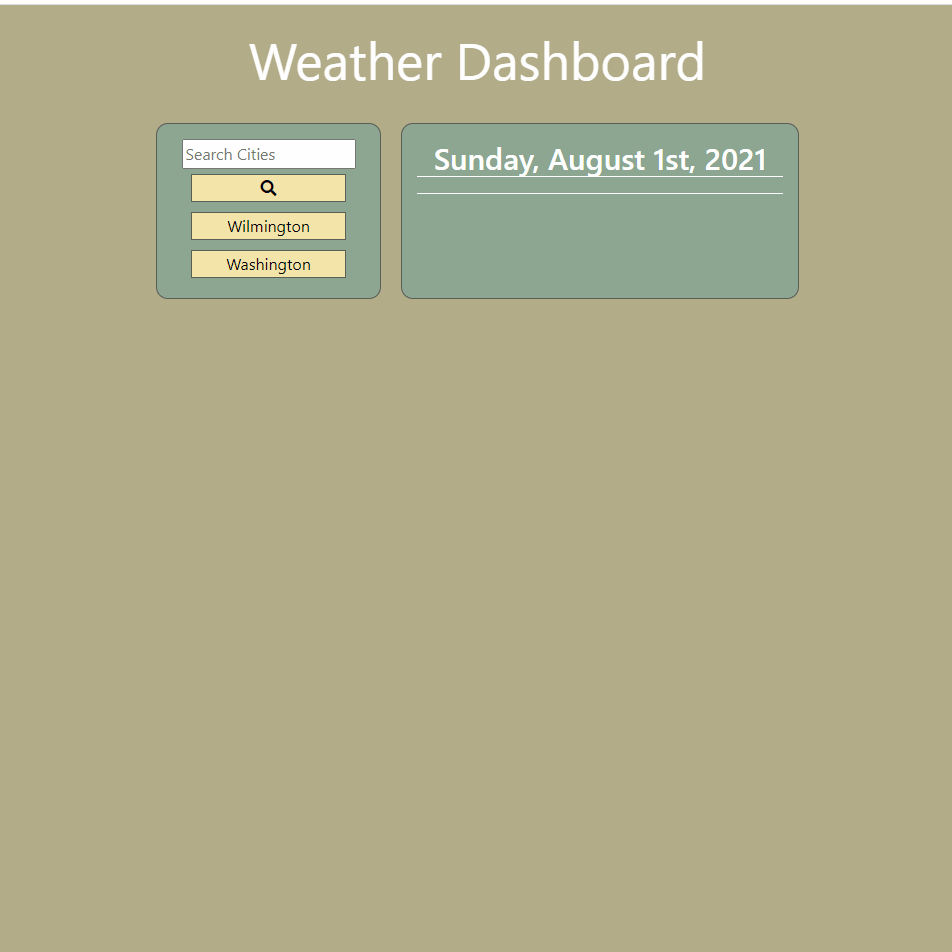

# Weather_Dashboard
Weather Dashboard

[[Repository Link](https://github.com/ElusiveSkies/Weather_Dashboard)]

[[Deployed Weather Dashboard](https://elusiveskies.github.io/Weather_Dashboard)]

## Table of Contents

- [Description](#Description)
- [Usage](#Usage)
- [License](#License)
- [Questions](#Questions)

## Description
Allows user the search for a city, viewing the current weather and a five day forecast.
Created using Bootstrap, HTML, CSS, and JavaScript.

## Usage

Video of Usage

## License

MIT

## Questions

[[Contact me](mailto:elusiveskies@gmail.com)]

[[Elusiveskies](https://www.github.com/Elusiveskies)]